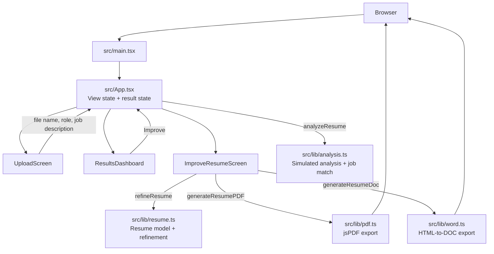
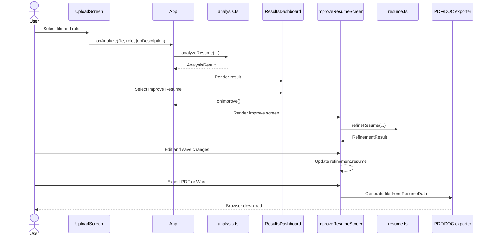

# ResumeAI Low-Level Design

## 1. Scope

ResumeAI is a client-side resume analysis prototype. It lets a user select a PDF, choose a target role, optionally paste a job description, review simulated analysis results, refine a sample resume, edit it, and export the refined version.

There is currently no backend, PDF parser, persistence layer, or real AI service.

## 2. Runtime Architecture

## 3. Main Components

| Component | Responsibility |
|---|---|
| `App` | Owns application view and analysis result; coordinates navigation and simulated delays. |
| `UploadScreen` | Handles file selection, drag/drop, target role, and optional job description. |
| `ResultsDashboard` | Renders score, breakdown, strengths, improvements, missing skills, recommendations, and job match. |
| `JobMatchSection` | Displays job-description match score and skill gaps. |
| `ImproveResumeScreen` | Runs refinement, shows before/after previews, supports editing and export. |
| `EditableResume` | Maintains a local editable copy of `ResumeData`. |
| `ResumePreview` | Renders a resume document in the browser. |
| `ScoreRing` / `CategoryBar` | Render animated score visualizations. |
| `ImproveWithAI` | Shows simulated bullet-point improvements and copy action. |

## 4. Domain Modules

### `src/lib/analysis.ts`

Defines `AnalysisResult`, `JobMatchResult`, `Recommendation`, and score category types.

Key functions:

- `analyzeResume(fileName, targetRole, jobDescription)` creates the complete analysis result.
- `analyzeJobMatch(jobDescription, targetRole)` compares job-description keywords with a hardcoded skill set.
- Filename parsing derives a display name for the resume owner.

### `src/lib/resume.ts`

Defines `ResumeData` and refinement-related types.

Key functions:

- `withOwnerName()` clones the sample resume and updates contact identity.
- `refineResume()` selects general or job-specific refinement.
- Refinement output includes the updated resume, changes, JD alignment, and warnings.

### Export Modules

- `generateResumePDF(resume)` creates and downloads an A4 PDF using `jsPDF`.
- `generateResumeDoc(resume)` creates and downloads a Word-compatible `.doc` file using an escaped HTML document.

## 5. State and Data Flow

`App` owns:

- `view`: current screen state.
- `result`: latest `AnalysisResult` or `null`.

`ImproveResumeScreen` owns:

- `phase`: `loading`, `result`, or `edit`.
- `refinement`: current `RefinementResult`.
- `tab`: original or refined preview.
- `applied`: whether refined changes were accepted.

Data flow:

1. `UploadScreen` collects inputs and calls `onAnalyze`.
2. `App` calls `analyzeResume()` and stores the result.
3. `ResultsDashboard` receives the result through props.
4. `ImproveResumeScreen` derives a refined `ResumeData` from the sample resume.
5. `EditableResume` returns edited data through `onSave`.
6. Export modules receive the final `ResumeData` and trigger browser downloads.

## 6. Primary Sequence

## 7. Configuration and Dependencies

- Vite serves and bundles the application.
- TypeScript provides static typing and path aliasing through `@/*`.
- Tailwind CSS provides styling.
- React manages UI state and rendering.
- `lucide-react` provides icons.
- `jsPDF` provides PDF generation.
- Google Fonts provide `Inter` and `Plus Jakarta Sans`.

## 8. Current Limitations

- Uploaded PDF contents are not parsed; only the filename is used.
- Analysis and refinement are deterministic simulations with timing delays.
- Results are not persisted across refreshes.
- The sample resume is refined instead of extracted resume content.
- There are no automated tests.
- `@supabase/supabase-js` is installed but not currently used.

## 9. Production Extension Points

- Replace `analyzeResume()` with an API call backed by PDF extraction and an AI service.
- Replace `SAMPLE_RESUME` with parsed resume content.
- Move analysis/refinement logic behind a backend boundary.
- Add request, loading, error, cancellation, and retry states.
- Add authentication and persistence if resumes need to be saved.
- Add unit tests for filename parsing, job matching, refinement, and export data preparation.
